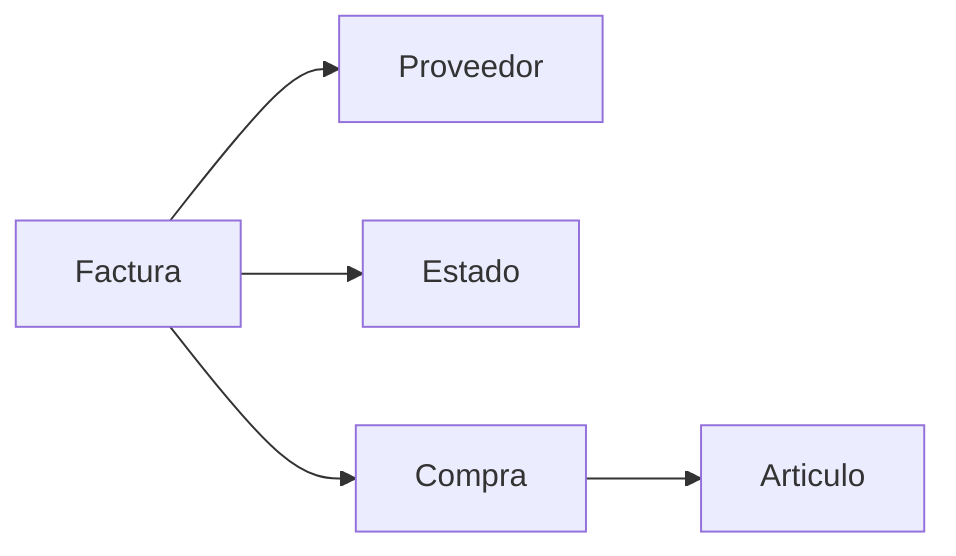

## Overview

The Bill Management module handles all supplier invoices (facturas) for the pharmacy, tracking payment status, due dates, and associated purchases. This system helps maintain accurate accounts payable records and ensures timely payments to suppliers.

## Database Schema

The bill management system uses two primary tables:

### Factura Table (Bills/Invoices)

| Field | Type | Description |
|-------|------|-------------|
| `id` | int(11) | Primary key, auto-increment |
| `numero` | int(11) | Invoice number |
| `fecha_factura` | date | Invoice date |
| `fecha_vencimiento_factura` | date | Invoice due date |
| `valor_iva` | decimal(12,2) | Tax amount (IVA) |
| `valor_factura` | decimal(12,2) | Total invoice amount |
| `proveedor_id` | int(11) | Foreign key to proveedor (supplier) |
| `estado_id` | int(11) | Foreign key to estado (payment status) |

### Estado Table (Payment Status)

| ID | Status Name | Description |
|----|-------------|-------------|
| 1 | Por pagar | Unpaid/Pending payment |
| 2 | Pagada | Paid/Completed |

<Info>
  The `estado` table contains only two predefined statuses. These represent the payment lifecycle of an invoice from creation to payment completion.
</Info>

## Relationships

The invoice system connects to other parts of the application:



- **Proveedor**: Each invoice is linked to a supplier
- **Estado**: Tracks current payment status
- **Compra**: Purchase items are associated with invoices
- **Articulo**: Individual products on the purchase

## Creating a New Invoice

To register a new supplier invoice:

<Steps>
  <Step title="Navigate to Bills">
    Access the Bills/Invoices module from the main menu
  </Step>
  
  <Step title="Click Register Invoice">
    Click the "Registrar Facturas" button
  </Step>
  
  <Step title="Enter Invoice Details">
    Complete the required fields:
    - **Proveedor**: Select the supplier
    - **Numero**: Invoice number from supplier
    - **Fecha de Factura**: Invoice date
    - **Fecha de Vencimiento**: Payment due date
    - **Valor IVA**: Tax amount
    - **Valor Factura**: Total invoice amount
    - **Estado**: Payment status (Por pagar/Pagada)
  </Step>
  
  <Step title="Save Invoice">
    Submit the form to create the invoice record
  </Step>
</Steps>

## Viewing Invoice List

The invoice list displays all bills with the following information:

| Column | Description | Format |
|--------|-------------|--------|
| **#** | Sequential number | Integer |
| **Proveedor** | Supplier name | Text |
| **Numero Factura** | Invoice number | Integer |
| **Fecha de Factura** | Invoice date | Date |
| **Estado** | Payment status | "Por pagar" or "Pagada" |
| **Fecha de Vencimiento** | Due date | Date |
| **Valor IVA** | Tax amount | Currency (formatted) |
| **Valor Factura** | Total amount | Currency (formatted) |
| **Actions** | Edit, view, delete buttons | Icons |

### Currency Formatting

Invoice amounts are displayed with proper formatting:

```php
number_format($row['valor_iva'], 2, ',', '.')
number_format($row['valor_factura'], 2, ',', '.')
```

This produces values like: `1.234.567,89` (Colombian peso format)

## Payment Status Tracking

### Status Workflow

<Steps>
  <Step title="Por pagar (Unpaid)">
    Initial status when invoice is created. Indicates payment is due.
  </Step>
  
  <Step title="Pagada (Paid)">
    Updated when payment is completed. Marks the invoice as settled.
  </Step>
</Steps>

### Changing Payment Status

To update an invoice's payment status:

1. Navigate to the invoice list
2. Click the edit icon (pencil) next to the invoice
3. Change the **Estado** field from "Por pagar" to "Pagada"
4. Save the changes

<Tip>
  Regularly update payment statuses to maintain accurate accounts payable records and avoid duplicate payments.
</Tip>

## Editing Invoices

Invoice details can be modified through the edit function:

- Access by clicking the edit icon in the invoice list
- All invoice fields can be updated
- Changes are saved immediately
- Audit trail records the modification

## Viewing Invoice Details

To view complete invoice information:

1. Click the view icon (eye) next to any invoice
2. Review all invoice details including:
   - Supplier information
   - Invoice and due dates
   - Tax and total amounts
   - Payment status
   - Associated purchase items (if any)

## Deleting Invoices

Invoices can only be deleted under specific conditions:

<Warning>
  An invoice cannot be deleted if it has associated purchase items (compra records). You must delete the purchases first.
</Warning>

### Deletion Process

<Steps>
  <Step title="Locate Invoice">
    Find the invoice in the list
  </Step>
  
  <Step title="Click Delete">
    Click the delete icon (trash)
  </Step>
  
  <Step title="System Validation">
    The system checks for associated purchases using:
    ```sql
    SELECT COUNT(*) as total 
    FROM compra 
    WHERE compra.factura_id = $id
    ```
  </Step>
  
  <Step title="Confirm or Block">
    - If no purchases exist: Confirm deletion dialog appears
    - If purchases exist: Warning message is displayed
  </Step>
</Steps>

### Error Message

If deletion is blocked, you'll see:

<Warning>
  **¡Atención!** Esa factura ya tiene artículos comprados, no puede ser eliminada.
</Warning>

## Data Integrity

The system maintains referential integrity through foreign key constraints:

### Supplier Reference
```sql
CONSTRAINT `fk_factura_proveedor` 
FOREIGN KEY (`proveedor_id`) 
REFERENCES `proveedor` (`id`) 
ON DELETE NO ACTION 
ON UPDATE NO ACTION
```

<Note>
  Invoices cannot be deleted if the supplier has related purchase records.
</Note>

### Status Reference
```sql
CONSTRAINT `factura_ibfk_1` 
FOREIGN KEY (`estado_id`) 
REFERENCES `estado` (`id`)
```

## Purchase Items Association

Each invoice can have multiple purchase items (compra):

- Links invoices to specific products purchased
- Tracks quantities and unit prices
- Associates expiration dates with purchases
- Maintains complete purchase history

Query to retrieve invoice with supplier and status:

```sql
SELECT 
  proveedor.nombre as proveedor, 
  estado.nombre as estado, 
  factura.id as id, 
  numero, 
  fecha_factura, 
  fecha_vencimiento_factura, 
  valor_iva, 
  valor_factura
FROM factura, proveedor, estado 
WHERE proveedor_id = proveedor.id 
  AND estado_id = estado.id
```

## Accounts Payable Management

### Monitoring Unpaid Invoices

To track outstanding payments:

1. Filter or sort by **Estado** = "Por pagar"
2. Review **Fecha de Vencimiento** for due dates
3. Prioritize payments based on due dates
4. Update status to "Pagada" after payment

### Payment Tracking Best Practices

<CardGroup cols={2}>
  <Card title="Regular Review" icon="calendar">
    Check unpaid invoices weekly to avoid late payments
  </Card>
  
  <Card title="Due Date Monitoring" icon="clock">
    Set reminders for upcoming payment due dates
  </Card>
  
  <Card title="Status Updates" icon="check-circle">
    Update invoice status immediately after payment
  </Card>
  
  <Card title="Supplier Relations" icon="handshake">
    Maintain accurate records to preserve supplier relationships
  </Card>
</CardGroup>

## Reporting Considerations

### Financial Reports

The invoice data supports various financial reports:

- Total accounts payable (sum of "Por pagar" invoices)
- Payment history (all "Pagada" invoices)
- Supplier spending analysis
- Tax liability calculations (sum of valor_iva)

### Query Examples

Total unpaid invoices:
```sql
SELECT SUM(valor_factura) 
FROM factura 
WHERE estado_id = 1
```

Overdue invoices:
```sql
SELECT * 
FROM factura 
WHERE estado_id = 1 
  AND fecha_vencimiento_factura < CURDATE()
```

## Audit Trail

All invoice operations are automatically logged:

- Invoice creation
- Invoice modification
- Invoice deletion (when permitted)
- Status changes

Each action records:
- User who performed the action
- Timestamp
- IP address
- Description of the change

<Info>
  See the [Audit Logs](/administration/audit-logs) documentation for more information on tracking invoice-related activities.
</Info>
